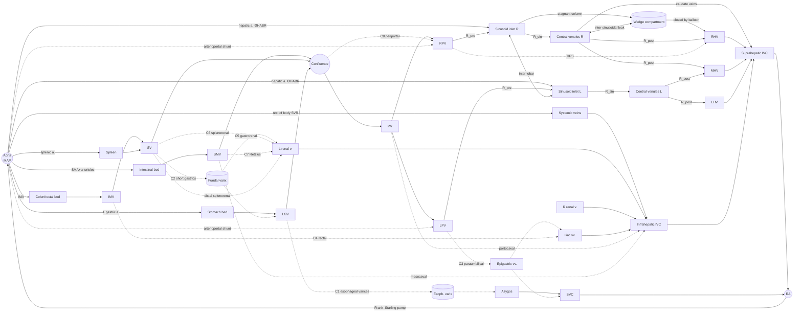

# Portal Pressure Simulator: Design Blueprint (v0.1, draft)

> **What this is:** the design spec for rebuilding the Portal Pressure Simulator from scratch.
> It's written for the agent or developer who will build it. It covers **what** to build and
> **why**, with enough **how** (the physics model, data schema, layout, and interactions)
> that you won't have to guess.
>
> **Status:** an early draft that will change a lot. Everything here can be negotiated except the
> **Design Principles (§1)** and the **Physiological Acceptance Tests (§12)**. If you change those,
> talk to the product owner first.
>
> **Scope:** education only. This isn't a clinical decision tool, and the app must say so (§14).

---

## Table of contents

0. [Vision in one paragraph](#0-vision-in-one-paragraph)
1. [Design principles](#1-design-principles)
2. [Audience & learning objectives](#2-audience--learning-objectives)
3. [Information architecture & modes](#3-information-architecture--modes)
4. [Screen layout (desktop / tablet / phone)](#4-screen-layout)
5. [Visual language & design tokens](#5-visual-language--design-tokens)
6. [The anatomical stage (the centrepiece)](#6-the-anatomical-stage)
7. [Physics engine: the hemodynamic model](#7-physics-engine)
8. [Interactions, tools & direct manipulation](#8-interactions-tools--direct-manipulation)
9. [Readouts, instruments & charts](#9-readouts-instruments--charts)
10. [Scenarios, interventions & the case engine](#10-scenarios-interventions--the-case-engine)
11. [Pedagogy layer (Learn mode)](#11-pedagogy-layer)
12. [Physiological acceptance tests](#12-physiological-acceptance-tests)
13. [Technical architecture](#13-technical-architecture)
14. [Accessibility, performance, safety copy](#14-accessibility-performance-safety-copy)
15. [Roadmap (phased build)](#15-roadmap)
16. [Open questions](#16-open-questions)

---

## 0. Vision in one paragraph

A **living anatomical model of the portal circulation** that learners can poke, pinch, clot,
stent, and bleed. Resistance goes up and blood **finds another way**: collateral veins open,
esophageal varices **swell and thin until they rupture**, the portal vein **reverses direction**,
the spleen enlarges, and ascites fills the abdomen. None of this is scripted. It all **emerges
from one physically consistent pressure–flow model**. Every number on screen can be
traced back to a cause with a "Why?" button. It should feel like a flight simulator for
hepatology and look like a modern medical atlas that happens to be alive.

---

## 1. Design principles

| # | Principle | What it means in practice |
|---|-----------|---------------------------|
| P1 | **Emergent, not scripted** | Flow reversal, varix inflation, and ascites come out of the equations. Never add `if (cirrhosis) showVarices()`. The UI only *reports* what the model computes. |
| P2 | **One model, many lenses** | The anatomy view, circuit view, charts, Doppler, endoscopy, and dashboard all read the same state. None of them owns data. |
| P3 | **Direct manipulation first** | Every parameter you can change with a slider you can also change *on the anatomy* (pinch a vessel, paint fibrosis, drag a catheter). Sliders are the precise fallback, not the main interface. |
| P4 | **Predict → Observe → Explain** | Lessons ask the learner to predict an outcome before the model runs. The "Why?" trace explains the result in plain causal language. |
| P5 | **Clinically faithful numbers** | Pressures in mmHg, flows in L/min or mL/min, and clinical thresholds (HVPG 5 / 10 / 12 / 20, PPG < 12 after TIPS) match the literature within stated tolerances (§12). |
| P6 | **Calm by default, dramatic on demand** | Healthy state is quiet and elegant. Pathology gets progressively more visual: swelling, color shift, pulsing, warnings. A bleed is loud. |
| P7 | **Never color alone** | Every color encoding also has shape, motion, text, or pattern. |
| P8 | **60 fps on a mid-range phone** | Physics runs in a worker. Rendering is budgeted. Motion respects `prefers-reduced-motion`. |

---

## 2. Audience & learning objectives

**Primary users:** medical students (preclinical physiology and clinical GI), internal-medicine and GI
residents, and nurses and APPs in hepatology. **Secondary:** educators projecting in lectures, and curious patients
(with simplified copy).

**By the end, a learner can:**

1. Explain portal pressure as **P = Q × R** and say why both *forward flow* (splanchnic
   vasodilation, hyperdynamic circulation) and *backward resistance* (fibrosis) raise it.
2. Classify portal hypertension as **prehepatic, presinusoidal, sinusoidal, postsinusoidal, or
   posthepatic** from the measured WHVP, FHVP, HVPG, PV pressure, and ascites protein.
3. Explain why **HVPG is normal in presinusoidal disease and in right heart failure**, for
   different reasons.
4. Name the major **portosystemic collaterals** and predict which one enlarges for a given
   obstruction (e.g. splenic vein thrombosis leads to isolated gastric varices).
5. Use **Laplace's law** to explain why large, thin-walled varices under high transmural pressure
   rupture.
6. Predict the hemodynamic effect of **NSBBs, carvedilol, terlipressin/octreotide, EVL, TIPS,
   surgical shunts, BRTO, balloon tamponade, paracentesis, and transfusion**, including their
   unintended consequences (post-TIPS encephalopathy, rising pressure after BRTO, rebleeding
   after over-transfusion).
7. Explain the causes of **hepatofugal flow** and of **reversed intrahepatic portal flow after TIPS**.
8. Explain the **hepatic arterial buffer response**, and why liver perfusion doesn't simply fall
   in proportion to portal flow.

---

## 3. Information architecture & modes

The top bar has four modes. All of them share the same stage and engine.

```
┌─────────────────────────────────────────────────────────────────────────────┐
│  ◉ Explore      ◎ Learn      ◎ Cases      ◎ Compare                          │
└─────────────────────────────────────────────────────────────────────────────┘
```

| Mode | Purpose | What's unlocked |
|------|---------|-----------------|
| **Explore** (default) | Sandbox with every tool, every parameter, and all presets | Everything |
| **Learn** | Guided lessons (§11) that follow Predict → Observe → Explain | Only the tools each lesson step allows. Other controls are shown but locked, with a lock tooltip |
| **Cases** | Time-pressured clinical scenarios such as a variceal bleed (§10.4) | Clinical actions only (drugs, procedures, fluids). Raw resistances are hidden, like real life |
| **Compare** | Two synchronized engines (A and B) side by side, or overlaid as a "ghost" | Snapshot, clone, and diff. Charts overlay A and B |

**Global elements (every mode):**

- **Time controls:** play/pause, speed (0.25× to 8×), step, and a **clock switch**:
  `Hemodynamic (seconds)` ⇄ `Disease (days → months)` (§7.6).
- **View switch:** `Anatomic` ⇄ `Circuit`, with a morph animation between the two (§6.5).
- **Layers** menu: pressure color, flow particles, labels, values, collaterals, organs, grid.
- **Presets** menu (§10.1).
- **Undo/redo** for every manipulation (Ctrl/Cmd+Z). History is part of the state store.
- **Share:** encodes the scenario in the URL, so teachers can send a link to an exact state.
- **Units:** mmHg ⇄ cmH₂O ⇄ kPa for pressure, and L/min ⇄ mL/min for flow.

---

## 4. Screen layout

### 4.1 Desktop (≥ 1280 px): "cockpit"

```
┌──────────────────────────────────────────────────────────────────────────────────────────┐
│ ▣ Portal Pressure Simulator   [Explore|Learn|Cases|Compare]   ⏵ 1× ⟲  ⏱ Hemo|Disease  ⚙ ⤴ │  top bar 56px
├────┬───────────────────────────────────────────────────────────────┬─────────────────────┤
│ 🖐 │                                                               │  INSPECTOR          │
│ ✚  │                                                               │  (context-aware)    │
│ ⌇  │                   ANATOMICAL STAGE                            │                     │
│ ⊘  │        (SVG anatomy + WebGL particle layer)                   │  Selected: Portal   │
│ ◍  │                                                               │  vein               │
│ ⊕  │     floating value chips on vessels                           │  P  18.4 mmHg ▲     │
│ 🎯 │     event callouts anchored to anatomy                        │  Q  0.62 L/min ⟲    │
│ 📡 │                                                               │  v  9 cm/s          │
│ 🔭 │                                           [mini-map] [zoom]   │  d  14.1 mm         │
│    │                                                               │  [Why?]             │
│ 72 │                                                               │  ── Parameters ──   │
│ px │                                                               │  Stenosis  ▭▭▭▭ 0%  │
│rail│                                                               │  Thrombus  ▭▭▭▭ 0%  │
│    │                                                               │  320–380px          │
├────┴───────────────────────────────────────────────────────────────┴─────────────────────┤
│ DOCK  [Pressure profile] [Scope] [Flow Sankey] [Liver perfusion] [Doppler] [Endoscopy]    │  resizable
│  ┌ clinical strip: HVPG 14 ▲ │ PPG 16 │ PV flow 0.6 ⟲ │ Shunt 38% │ Varix risk ██▒ │ ... ┐ │  220–360px
└──────────────────────────────────────────────────────────────────────────────────────────┘
```

- **Left tool rail (72 px):** icon tools (§8.1). Hovering shows the name and shortcut. Clicking a tool
  opens a flyout for its options.
- **Stage:** takes up all remaining space. Pan (space+drag or middle mouse), zoom (wheel or pinch),
  and double-click an organ to **semantic-zoom** into it (§6.4).
- **Inspector (right, 320–380 px, collapsible):** shows whatever is selected (vessel, node,
  organ, intervention, or event). When nothing is selected it shows the **Global parameters** panel
  (§8.4).
- **Dock (bottom, resizable, collapsible):** chart tabs, with the **Clinical strip** pinned above them
  (a single row of key metrics with threshold coloring).

### 4.2 Tablet (768–1279 px)

- The stage is full width. The tool rail becomes a **floating vertical pill** on the left edge.
- The inspector becomes a **right-side sheet** that slides over the stage and can be pinned in landscape.
- The dock becomes a **bottom sheet** with three detents: peek (clinical strip only), half, and full.

### 4.3 Phone (< 768 px), portrait-first

```
┌──────────────────────────┐
│ ▣ PPS   Explore ▾   ⏵ ⋯  │ 48px
├──────────────────────────┤
│                          │
│     STAGE (≈ 58vh)       │  pinch-zoom, 1-finger pan
│   (schematic by default) │  tap = select, long-press = tool radial menu
│                          │
├──────────────────────────┤
│ HVPG 14 │ PV 18 │ ⟲ 38%  │  clinical strip, horizontally scrollable
├──────────────────────────┤
│ [Controls][Readouts][Charts][Lesson] │  bottom sheet tabs
│  …sheet content…          │  drag up to expand
└──────────────────────────┘
```

- Phones default to the **Circuit view** (§6.5), which is more legible when small. Anatomic is one tap away.
- A **long-press radial menu** replaces the tool rail: Pinch, Clot, Stent, Band, Probe, Catheter.
- All touch targets are at least **44 × 44 px**. Sliders get a **fine-tune mode**: press and hold,
  then drag vertically to reduce sensitivity 10×.
- Landscape on phone uses the tablet layout.

### 4.4 Projector / lecture mode

`F` toggles this mode. It hides the chrome, increases label sizes by 1.5×, raises contrast, and
lets you place **big-number overlays** (e.g. a large HVPG) anywhere on the stage. The
presenter's clicker (arrow keys) steps through lesson stages.

---

## 5. Visual language & design tokens

### 5.1 Aesthetic direction

**"Living atlas."** Soft, semi-schematic anatomy in the style of a modern medical illustration
(think a simplified Netter, rendered flat with subtle depth). Organs sit in the background at low
contrast. **Vessels are the heroes.** They're drawn with real proportional widths, colored by pressure,
and animated with flowing cells. There are two themes:

- **Atlas (light):** warm paper background, ink-dark text, organs in muted flesh tones.
- **Monitor (dark):** near-black blue background like an ICU monitor, with vessels that glow slightly.
  This is the default for projector mode.

### 5.2 Color tokens (define on `:root`, re-map for dark)

```css
:root {
  /* surfaces */
  --bg:            #F7F5F2;  /* warm paper */
  --surface:       #FFFFFF;
  --surface-2:     #F1EEEA;
  --border:        #E3DED7;
  --text:          #1D2330;
  --text-muted:    #5B6475;
  --focus:         #3B82F6;

  /* anatomy (low-contrast backgrounds) */
  --organ-liver:   #C9887A;  --organ-liver-a: .22;
  --organ-spleen:  #9C6B8E;  --organ-spleen-a: .22;
  --organ-gut:     #E0B48F;  --organ-gut-a: .18;
  --organ-stomach: #D9A38F;  --organ-stomach-a: .20;
  --organ-heart:   #B5505C;  --organ-heart-a: .22;
  --organ-kidney:  #A9745F;  --organ-kidney-a: .20;
  --artery:        #C2414B;  /* arteries: fixed hue, NOT on the pressure scale */

  /* semantic status */
  --ok:            #1F9D74;
  --caution:       #D99A1E;
  --danger:        #D23B3B;
  --critical:      #A3134B;
  --info:          #2D6CDF;

  /* flow semantics */
  --flow-normal:   #19A7A0;  /* hepatopetal / physiological direction */
  --flow-reversed: #F0782B;  /* hepatofugal / reversed; always paired with ⟲ glyph + dashed halo */
}
```

### 5.3 The pressure colormap (venous and portal vessels only)

A **perceptually uniform sequential map** interpolated in **OKLCH**, with lightness decreasing
steadily as pressure rises so it still reads in grayscale. Anchor stops:

| mmHg | Meaning | Color (approx.) |
|------|---------|-----------------|
| 0 | RA / collapse | `#DCEBF7` pale ice |
| 5 | normal portal / HVPG upper normal | `#7CC4E4` sky |
| 10 | **CSPH** threshold | `#6A7FD8` periwinkle |
| 12 | **variceal bleeding threshold** | `#8E4FC4` violet |
| 20 | high-risk bleeding | `#C0307A` magenta |
| 30+ | extreme | `#6E0B3A` deep wine |

- The legend is a slim vertical bar with **tick marks at 5, 10, 12, and 20**, each labeled with its
  clinical meaning on hover.
- Arteries aren't on this scale (they'd saturate at 90 mmHg). They're drawn in `--artery`, thinner and at lower opacity, so
  they read as "supply lines."
- **Alternative color modes** (Layers menu):
  1. *Absolute pressure* (default).
  2. *Pressure drop*: colors each **edge** by ΔP, so you can see where resistance lives.
  3. *Flow direction*: teal for physiological direction, orange for reversed.
  4. *Change from baseline*: a diverging blue ↔ red map showing ΔP versus a snapshot.

### 5.4 Typography

- UI: **Inter** (or IBM Plex Sans). Scale: 12 / 13 / 15 / 17 / 20 / 24 / 32.
- Numbers: **JetBrains Mono** or **IBM Plex Mono** with `font-variant-numeric: tabular-nums`, so
  values don't jitter as they update.
- Values always show units in a lighter weight: `18.4 mmHg`.
- Precision: pressures to 0.1 mmHg, flows to 0.01 L/min, percentages as integers. Don't show more
  precision than the model deserves.

### 5.5 Motion

- UI transitions: 180–260 ms, `cubic-bezier(.2,.8,.2,1)`.
- Value changes: numbers **tick** over 250 ms, and a small ▲ or ▼ delta arrow fades out after 1.5 s.
- Vessel diameter changes: smoothed with a 300 ms spring so vessels look like they inflate
  rather than snap.
- Events: callouts slide from the anatomical anchor with a leader line. **Critical** events
  (variceal rupture) get a short 2-cycle red vignette pulse around the stage. Never flash more than 3 times
  per second (WCAG 2.3.1).
- `prefers-reduced-motion`: replace particles with static chevrons along the vessel spaced by
  flow magnitude, disable pulses, and keep only opacity transitions.

### 5.6 Iconography

Line icons (Lucide style, 1.5 px stroke). Custom glyphs you'll need: `pinch`, `clot`, `stent`,
`band`, `balloon`, `catheter`, `probe`, `doppler`, `endoscope`, `reversed-flow ⟲`, `varix`.

---

## 6. The anatomical stage

### 6.1 Canvas & orientation

- Use a logical coordinate space of **1600 × 1000** units, scaled to fit the viewport.
- Use the **standard anatomical frontal view**: the patient's right is on the viewer's **left**. So the liver
  is on the screen-left, and the spleen and stomach are on the screen-right. **Don't mirror this.** Anatomy
  teachers will notice.
- Rough placement:
  - **Heart (RA)** top-center, slightly left. **SVC** comes in from above and the **IVC** from below.
  - **Esophagus** runs down the midline from the top to the stomach. The azygos vein runs along its
    right-posterior side (drawn as a thin vein just screen-left of the esophagus, going up to the SVC).
  - **Liver** is a large lobe at upper-left with a visible caudate lobe near the IVC. The three hepatic veins
    fan into the suprahepatic IVC.
  - **Stomach** is upper-right of center, and the **spleen** is at the far upper-right.
  - **Pancreas** is a faint horizontal band. The **splenic vein** runs along it from right to left into the
    **confluence** behind the pancreatic neck.
  - **Small intestine/mesentery** fills the lower-center. **SMV** rises vertically to the confluence.
  - The **colon frame** runs around the edges. **IMV** rises on the right side into the splenic vein.
  - **Kidneys** sit on both sides. The **left renal vein** crosses in front of the aorta to the IVC (this is where
    the splenorenal and gastrorenal shunts drain).
  - **Rectum** is at the bottom-center: superior rectal to IMV (portal), and middle/inferior rectal to the iliac veins (systemic).
  - **Umbilicus** is at lower-center on the anterior wall layer. The paraumbilical vein runs from the **left portal vein**
    along the falciform ligament to the umbilicus, then fans out as a caput medusae when it's recruited.

### 6.2 Vessel rendering

Each vessel is an authored **SVG centerline path** (`<path id="v-PV">`). The renderer draws it as:

1. A **wall stroke**: outer width = lumen diameter + 2 × wall thickness. Neutral color. It thins
   visibly as it distends.
2. A **lumen fill**: width = current lumen diameter × a visual gain (anatomy isn't to scale, so use one
   global gain plus a per-vessel minimum on-screen width of 3 px). Colored by the pressure map (§5.3).
3. A **flow particle layer** (WebGL/Canvas): red-cell sprites that move along the centerline.
   - **Speed** is proportional to mean velocity (Q/A), compressed with a log scale for display, and the legend says so.
   - **Density** is proportional to |Q|.
   - **Direction** follows the sign of Q. When a vessel's flow reverses, particles **decelerate,
     stop, and turn around** over ~600 ms (they're smoothed and don't teleport). The vessel also gets a dashed
     orange halo and a ⟲ badge.
   - When flow is near zero (stagnation, |v| < 5 cm/s in the PV), particles jitter in place and a
     "stasis" hatch appears. This hints at thrombosis risk.
4. **Value chips** (toggleable) sit on major vessels: `PV 18.4`. Tapping one selects the vessel.

**Distensibility is visible.** Vessel lumen area comes from the tube law (§7.3), so the
splenic vein, left gastric vein, and varices swell visibly as pressure rises. Arteries don't swell
noticeably.

### 6.3 Collaterals & varices (the "hidden network")

In a healthy state, collaterals are **ghosted**: 1 px dotted and 15% opacity, visible only when the
"Collaterals" layer is on. As they're recruited (§7.4), they:

- fade in and thicken, following the model's diameter,
- start carrying particles,
- become tortuous: the renderer adds a sinusoidal wiggle to the centerline with amplitude
  proportional to (d / d_max). This mirrors the corkscrew look of real varices.

**Esophageal varices** get special rendering: a cluster of 3–4 beaded, serpentine columns in
the lower esophagus. Each bead is an ellipse whose radius follows the varix model. When wall
tension goes up, the wall stroke thins and gets a **red-wale overlay** (thin red streaks), which is the
real endoscopic sign of high risk. On rupture, a particle jet escapes into the esophageal lumen.

Collaterals to model and draw (portal side → systemic side):

| ID | Collateral | Portal source | Systemic drain | Clinical face |
|----|------------|---------------|----------------|---------------|
| C1 | Left gastric (coronary) vein → **esophageal varices** | PV/confluence | Azygos → SVC | Esophageal varices, the main bleeding source |
| C2 | Short gastric / posterior gastric → **fundal varices** | Splenic vein | via C1 to azygos, **or** via C5 | Gastric varices (GOV2/IGV1) |
| C3 | **Paraumbilical vein** | Left portal vein | Epigastric → iliac/IVC and internal thoracic → SVC | Caput medusae, Cruveilhier–Baumgarten murmur |
| C4 | Superior ↔ middle/inferior **rectal veins** | IMV | Internal iliac → IVC | Anorectal varices (not hemorrhoids) |
| C5 | **Gastrorenal shunt** | Fundal varices | Left renal vein → IVC | The target of BRTO |
| C6 | **Spontaneous splenorenal shunt** | Splenic vein | Left renal vein → IVC | Can decompress a lot, and causes encephalopathy |
| C7 | **Retroperitoneal (Retzius) veins** | SMV/IMV territory | Lumbar/renal → IVC | Usually minor, rounds out the network |
| C8 | **Pericholedochal / periportal** (cavernous transformation) | SMV/confluence | Intrahepatic portal branches | Only recruited when the main PV is occluded. It's hepatopetal. |

### 6.4 Semantic zoom levels

Double-click (or pinch past a threshold) on an organ to go deeper:

| Level | Name | Content |
|-------|------|---------|
| L0 | **Whole-body loop** | Heart → aorta → splanchnic beds → portal system → liver → IVC → heart. Shows how CO and MAP link to portal inflow. |
| L1 | **Portal anatomy** (default) | Everything in §6.1 |
| L2 | **Liver lobule** | A hexagonal lobule with **portal triads** at the corners (portal venule, hepatic arteriole, bile duct), **sinusoids** running radially to the **central vein**, and the **space of Disse** with lymph drainage. Shows the three resistance sites visually: **presinusoidal** (portal tract), **sinusoidal** (stellate-cell contraction, collagen in Disse, capillarization with fenestrae closing), and **postsinusoidal** (central vein / terminal hepatic venule). The fibrosis brush (§8.1) works here too. Hepatic-artery blood visibly **merges** into the sinusoids. |
| L3 | **Varix cross-section** | A cross-section of the esophageal wall with a varix. Shows radius r, wall thickness w, transmural pressure arrows (P_varix − P_lumen), and a **tension gauge (T = ΔP·r / w)** that fills toward the rupture line. The balloon-tamponade tool works here as a visible luminal balloon. |
| L2b | **Spleen** | Pulp congestion. Spleen length gauge (cm) and platelet-sequestration illustration |
| L2c | **Peritoneum** | Side view of the abdomen with ascites level rising, an intra-abdominal pressure gauge, and a paracentesis needle |

Transitions: a 400 ms zoom into the organ's bounding box, a crossfade to the detail art, and a breadcrumb
at the top-left (`Body › Portal system › Liver lobule`).

### 6.5 Circuit view

This is the same graph as the anatomy, drawn as a **subway-map/electrical schematic**. Nodes are
circles, resistances are resistor glyphs (zig-zag, or boxes with a width inversely proportional to R),
and compliances are small capacitor symbols. Layout goes left to right from **source (aorta)** to **sink
(RA)**, so the **pressure falls from left to right** and the pressure-drop color mode is instantly
readable. Toggling views **morphs** each node from its anatomic position to its schematic position
over 600 ms. That's an "aha" moment for students coming from physics.

---

## 7. Physics engine

### 7.1 Modeling approach

A **0-D lumped-parameter network** (the electrical analogue) with **nonlinear elements** and
**two timescales**:

- **Fast (hemodynamic) timescale, milliseconds to minutes:** pressures, flows, vessel areas, reflexes.
- **Slow (remodeling/disease) timescale, days to months:** collateral growth, varix
  enlargement, splenomegaly, splanchnic vasodilation, ascites accumulation, fibrosis progression.

Conventions:

- State: node pressures **P** (mmHg), node volumes **V** (mL), edge flows **Q** (mL/s internally,
  displayed as L/min).
- Resistance **R** is in PRU (mmHg·s/mL). Display it in Wood units (mmHg·min/L) if the user asks.
  1 WU = 0.06 PRU.
- The flow sign convention is **defined per edge** in its *physiological direction*
  (e.g. PV → liver is positive). **Negative flow means reversed**, and that's the only thing the UI uses to detect reversal.
- **The portal system has no valves.** Every portal and collateral edge is bidirectional. That's
  deliberate, and Lesson 1 teaches it. Only the heart valves and systemic limb veins have diode behavior.

### 7.2 Network topology (v1)



About 35 nodes and 55 edges. The **topology is data** (JSON, §13.3). Adding a vessel shouldn't need
engine code.

**Why each lobe has three resistance segments:** you need the pre / sinusoidal / post split to
reproduce the **HVPG vs. PV pressure dissociation** that separates presinusoidal from sinusoidal
disease. The node order is **PV branch → R_pre → sinusoid inlet (hepatic artery joins here) →
R_sin → central venules → R_post → hepatic vein**.

**The wedge compartment `W`** is a small side compartment that stands in for the sinusoids drained
by the wedged hepatic-vein branch. It connects to the **sinusoid inlet** through a "stagnant
column" conductance G_col, and to the neighbouring **central venules** through an
**inter-sinusoidal leak** conductance G_leak. When the balloon closes W's outflow, W settles to
`WHVP ≈ (G_col·P_inlet + G_leak·P_CV) / (G_col + G_leak)`:

- **Normal liver** (G_col : G_leak ≈ 4 : 1): WHVP sits slightly below PV pressure.
- **Sinusoidal cirrhosis** (cirrhosis shrinks G_leak toward 0): WHVP ≈ P_inlet ≈ PV pressure.
- **Presinusoidal block**: P_inlet is downstream of the block, so WHVP stays normal while PV is high.
- **Postsinusoidal disease or right heart failure**: both P_inlet and P_CV rise. In heart failure FHVP rises equally, so HVPG stays normal.

### 7.3 Element library

| Element | Equation | Used for |
|---------|----------|----------|
| **Linear resistor** | Q = (P₁ − P₂)/R, with R = 8μL/(πr⁴) · k_shape | Arterioles, capillary beds, stents |
| **Collapsible vessel** (tube law) | A = A₀ · f(P_tm) with P_tm = P − P_ext. Distends when P_tm > 0 (compliant, then stiffening), and collapses when P_tm < 0. Resistance R ∝ A₀²/A². | All veins, portal vessels, collaterals, IVC, hepatic veins |
| **Starling resistor** | If P_downstream < P_ext < P_upstream, then Q = (P_up − P_ext)/R (waterfall) | Hepatic veins at the diaphragm, IVC under tense ascites |
| **Nonlinear compliance** | V = V₀ + C·P for P ≥ 0, stiffening above P_knee: C_eff = C·exp(−(P−P_knee)/P_s) | Every venous node. **Unstressed volume V₀** matters for bleeding and transfusion. |
| **Inertance** (optional, pulsatile mode) | L · dQ/dt = ΔP − R·Q | IVC, hepatic veins, and PV to carry the RA waveform |
| **Diode (valve)** | Q = max(0, ΔP)/R, with a tiny leak | Heart valves, lower-limb veins only |
| **Recruitable collateral** | A tube-law vessel whose baseline diameter d is a **slow state** (§7.6). Initially d ≈ d_min, so R is huge. | C1–C8 |
| **Varix compartment** | A collapsible node with external pressure = esophageal luminal pressure (≈ 0 to −5 mmHg, inspiration-dependent) and its own wall thickness w (thins as it remodels). Computes **wall tension T = (P_var − P_lumen)·r / w**. | Esophageal varix, fundal varix |
| **Starling filter** | J_v = K_f[(P_c − P_i) − σ(π_c − π_i)] | Sinusoids → space of Disse (σ ≈ 0.1 in normal fenestrated sinusoids, rising to about 0.6 with capillarization), and splanchnic capillaries (σ ≈ 0.9) |
| **Lymph drain** | Q_lymph = min(J_v, Q_lymph_max), where Q_lymph_max slowly adapts upward | The overflow goes to the **peritoneal compartment** as ascites |
| **Heart** | CO = CO_max · contractility · sigmoid((P_RA − P₀)/k) (Frank–Starling), limited by HR. The pump moves volume from RA to AO. | Closes the circulation |
| **Reflex controllers** | First-order lag toward a target (τ ~ 5–30 s) | Baroreflex (MAP → SVR, HR, contractility, splanchnic tone) and **HABR** (below) |

**Hepatic arterial buffer response (HABR):**
hepatic arterial conductance is
`G_HA = G_HA0 · (1 + k_HABR · clamp((Q_PV,ref − Q_PV,in)/Q_PV,ref, 0, 1))` with τ ≈ 10 s and k_HABR ≈ 1.5.
Its capacity is reduced in advanced cirrhosis. It partly protects total liver perfusion when portal
flow falls (after TIPS, or with PVT). The liver-perfusion donut shows it.

**Arterioportal shunting:** an edge from the hepatic artery to the portal venules whose conductance
scales with cirrhosis severity. It's the mechanism that lets **the PV trunk reverse flow**
(arterial blood enters the portal branches and leaves retrograde through the PV into collaterals).
Without it, PV reversal can't emerge.

**External pressures:** every abdominal vein uses `P_ext = IAP` (intra-abdominal pressure).
Every thoracic vein uses `P_ext = P_pleural`, which follows a respiratory waveform (−5 mmHg inspiration,
−2 mmHg expiration, adjustable). The **Valsalva** button raises both to about +30 mmHg for 10 s.
IAP comes from ascites volume through an abdominal compliance curve (normal 5–7 mmHg; ≥ 12 is
intra-abdominal hypertension). **Ascites raises variceal and IVC pressure, and paracentesis
lowers it.** This comes out of the model.

**Blood viscosity:** μ depends on hematocrit. Hemorrhage plus crystalloid lowers Hct, which lowers μ and
slightly lowers R. It's minor, but it's there for completeness.

### 7.4 Collateral recruitment & remodeling (slow states)

For each recruitable collateral *i*, diameter **dᵢ** evolves on the disease clock:

```
dd/dt = k_shear · (τ_wall/τ_set − 1) · d          // flow-mediated outward remodeling
      + k_press · max(0, P_tm − P_open)            // pressure-driven dilation / angiogenesis (VEGF)
      − k_regress · (d − d_min)                    // regression when unloaded
clamp d ∈ [d_min, d_max]
τ_wall = 4μQ/(π r³)
```

- The **positive feedback** (more flow means more shear, so a bigger vessel, so more flow) is realistic.
  It's bounded by d_max and the pressure term.
- **P_open** is about 10 mmHg of portal-to-systemic gradient. That's why collaterals and varices
  appear around **HVPG ≥ 10 (CSPH)**, which is one of the acceptance tests.
- Collaterals have **hysteresis**: after TIPS they regress slowly (weeks), which matches how varices shrink
  after TIPS.

### 7.5 Varix model & rupture

- Radius r comes from the tube law, on top of a **slow baseline radius** r₀ that grows with chronic
  pressure (remodeling). Wall thickness w shrinks as r₀ grows (conservation of wall mass:
  w·r₀ ≈ const).
- **Tension:** `T = (P_var − P_lumen) · r / w`.
- **Grade display:** small is < 5 mm, large is ≥ 5 mm. Red wale signs appear when T/T_crit > 0.7.
- **Rupture is a stochastic hazard** evaluated each simulated second:
  `h = h₀ · max(0, T/T_crit − 1)^n` (n ≈ 3). Calibrate so that
  **rupture essentially never happens when HVPG < 12**. An **"Deterministic rupture"** option in
  settings makes lessons reproducible by rupturing exactly when T > T_crit.
- **Once ruptured:** a new edge `VAR → GI lumen (sink)` opens with a resistance scaled to the tear size.
  Blood volume drains, **MAP and portal pressure fall** (tamponade physiology), and the baroreflex
  kicks in. Bleeding can stop spontaneously if P_var falls below a clotting threshold. It can
  **rebleed** if pressure recovers, for example from **over-transfusion**. That's a key teaching loop.

### 7.6 Two clocks

| Clock | dt | What's integrated |
|-------|----|-------------------|
| **Hemodynamic** | 1 ms (pulsatile) / 10 ms (mean mode) | Pressures, flows, areas, reflexes, bleeding, respiration |
| **Disease** | 1 simulated day per step | d of collaterals, varix r₀ and w, spleen volume, splanchnic arteriolar tone (NO-mediated vasodilation as a function of chronic portal pressure, producing the hyperdynamic circulation), plasma volume expansion, lymph capacity, ascites volume, optional fibrosis progression |

In **Disease mode**, each day step first solves the fast system to a **quasi-steady state**
(Newton iteration, §7.7), then updates the slow states. The UI shows a calendar ("Month 7")
and a **fast-forward** control: +1 week, +1 month, +6 months, and "until next event."

### 7.7 Numerics

- The system is **stiff** (large compliances next to tiny resistances). Use **implicit
  (backward) Euler** with one Picard/Newton linearization per step. Each step solves
  `(C/dt + G(P)) · Pⁿ⁺¹ = C/dt · Pⁿ + s`, a sparse ~35×35 system. Dense LU is fine
  at this size.
- Run it in a **Web Worker** at a fixed timestep, decoupled from rendering. The worker posts
  a snapshot (P, Q, A, slow states, events) at **30 Hz**, and the main thread interpolates to 60 fps.
- Use a **steady-state solver** (Newton on G(P)·P = s with volume conservation) for presets,
  Disease-mode steps, and instant "jump to equilibrium" (the **⟲ Settle** button).
- **Conservation check:** total blood volume must be conserved to 0.01% per minute when there's no
  bleeding or infusion. Assert this in development builds.
- **Determinism:** seed the RNG (for rupture hazard) per scenario. The same URL gives the same run.

### 7.8 Baseline parameters & calibration targets

These are starting values. **Tune them with an automated calibration script** (§13.5) that fits the
free parameters to the targets.

**Targets (healthy adult at rest, 70 kg):**

| Quantity | Target | Tolerance |
|----------|--------|-----------|
| MAP | 93 mmHg | ±5 |
| CO | 5.0 L/min | ±0.3 |
| RA (mean) | 3 mmHg | ±2 |
| IVC (suprahepatic) | 3.5 mmHg | ±2 |
| FHVP | 4 mmHg | ±2 |
| WHVP | 7 mmHg | ±2 |
| **HVPG** | **3 mmHg** | 1–5 |
| PV pressure | 7.5 mmHg | 5–10 |
| Total hepatic blood flow | 1.5 L/min (~25–30% of CO) | ±0.2 |
| PV flow | 1.1 L/min (~70–75% of hepatic) | ±0.15 |
| HA flow | 0.4 L/min | ±0.1 |
| SMV flow / SV flow | ~0.7 / ~0.4 L/min | ±0.1 |
| PV mean velocity | 15–20 cm/s (d ≈ 12 mm) | within 12–25 |
| PV pulsatility index | < 0.3 | — |
| Collateral flow (total) | < 2% of portal flow | — |
| Hepatic lymph | ~0.5 mL/min | order of magnitude |
| IAP | 5 mmHg | ±2 |
| Spleen length | 11 cm | < 13 |

**Starting resistances (PRU, mmHg·s/mL)** that roughly produce the targets above:

| Segment | R₀ | Notes |
|---------|----|-------|
| SMA + intestinal arterioles | ~6.9 | (93 − 12) / 11.7 mL/s |
| Intestinal venules → SMV | ~0.26 | |
| SMV → confluence | ~0.13 | |
| Splenic artery + pulp | ~12 | |
| SV → confluence | ~0.2 | |
| PV trunk + branches | ~0.02 | |
| Presinusoidal: portal venules to sinusoid inlet (combined) | ~0.02 | "R_pre", carries portal flow only |
| Sinusoidal: sinusoid inlet to central venules (combined) | ~0.09 | "R_sin", carries portal + arterial flow |
| Postsinusoidal: central venules to hepatic veins (combined) | ~0.03 | "R_post" |
| Wedge compartment G_col : G_leak | 4 : 1 (normal) | Cirrhosis drives G_leak toward 0 |
| Hepatic veins → IVC | ~0.02 | |
| Hepatic artery (incl. arterioles) | ~12.8 | modulated by HABR |
| Collaterals, closed (d_min) | ≥ 300 | |
| Collaterals, fully open (d_max) | 0.1–0.5 | C6 splenorenal can reach ~0.1 |
| TIPS 8 mm / 10 mm | ~0.10 / ~0.04 | Poiseuille from d⁴ plus stent length ~8 cm; calibrate so a 10 mm TIPS in HVPG-20 cirrhosis gives PPG ≈ 8–11 |

---

## 8. Interactions, tools & direct manipulation

### 8.1 Tool rail

| Key | Tool | Gesture on stage | Effect in the model |
|-----|------|------------------|---------------------|
| `V` | **Select / Inspect** | Tap a vessel, node, or organ | Opens the inspector. A second tap on the same vessel pins a value chip. |
| `P` | **Pinch (stenosis)** | Press on a vessel and drag **perpendicular** to it. A caliper appears. | Sets % lumen narrowing (0–100%). R scales with (1 − s)⁻⁴ (Poiseuille), with a Young–Tsai-style turbulence correction above 70%. The vessel shows a visible waist. |
| `T` | **Thrombus brush** | Paint along a vessel | Occlusion % per segment, with a textured dark-red clot. **Acute** clot: no collaterals yet. After some disease-clock time, C8 (cavernous transformation) is recruited. |
| `F` | **Fibrosis brush** | Paint on liver lobes (L1) or lobule zones (L2). The brush has a **zone selector**: Portal (pre), Sinusoidal, Central (post). | Increases R_pre, R_sin, or R_post regionally. Sinusoidal fibrosis also raises σ (capillarization) and lowers inter-sinusoidal conductance. The liver surface gets a nodular texture proportional to severity. |
| `S` | **Stent / shunt** | Drag from one vessel to another. Valid targets glow as you drag. Release to create the shunt, then use the diameter handle. | Creates a new edge (TIPS: portal branch to hepatic vein; surgical shunts: named pairs). An **invalid** pair (e.g. artery to vein) is refused with an explanation. |
| `B` | **Band (EVL)** | Tap a varix bead | Obliterates that varix column (R becomes ∞ for that column). The model redirects pressure and flow, and other columns or gastric varices may grow. That's realistic "whack-a-mole." |
| `O` | **Occlude (BRTO / plug)** | Tap a collateral | Occludes it. For example, BRTO of C5 raises portal pressure and **can worsen esophageal varices and ascites** as an emergent result. |
| `L` | **Balloon (tamponade)** | Tap the esophagus or fundus | Raises luminal pressure on the varices, which lowers transmural pressure. It has a timer and shows a warning after 24 h of disease-clock time. |
| `C` | **Hepatic vein catheter** | Drag the catheter tip from the IVC into a hepatic vein, then press **Inflate balloon** | The procedure. See §8.3. |
| `D` | **Doppler probe** | Drop on any vessel | Opens the Doppler panel for that vessel (§9.4) |
| `E` | **Endoscope** | Tap the esophagus or stomach | Opens the endoscopy panel (§9.5) |
| `N` | **Paracentesis needle** | Tap the abdomen at L2c | Drains ascites at a chosen rate. Offers **albumin** replacement (and warns about post-paracentesis circulatory dysfunction if you skip it for > 5 L). |
| `M` | **Measure / probe** | Hover or tap anywhere on a vessel | Shows a live tooltip with P, Q, v, d, and ΔP from the previous node |

All manipulations can be undone, show up in the **history timeline** (a small track under the scope
chart with markers), and can be **edited later** by tapping the marker or the on-stage handle (e.g.
dragging the stenosis caliper again).

### 8.2 Hover and selection feedback

- Hovering a vessel highlights its **upstream and downstream path** (trace-to-source and
  trace-to-sink) and dims everything else to 40%.
- Hovering a node shows a **mini-balance**: inflows and outflows as a tiny horizontal bar.
- Selecting shows **handles** for everything you can manipulate on that element.

### 8.3 The HVPG measurement procedure (a flagship interaction)

1. Choose the **Catheter** tool. A sheath appears in the IVC (via the jugular approach, drawn coming
   down from the top).
2. **Drag** the catheter tip into the RHV, MHV, or LHV. Snapping and resistance-to-drag feedback make
   it feel like steering.
3. The readout shows **FHVP** live with a mini pressure trace.
4. Press **Inflate balloon**. In the model, the outflow edge of that vein's **wedge compartment
   `W`** (§7.2) closes. Flow in that column stops, and its pressure **equilibrates toward the
   sinusoid-inlet pressure**, pulled slightly down by the inter-sinusoidal leak. The trace
   rises and plateaus over ~20–40 s of simulated time, like the real tracing. (One wedge
   compartment per hepatic vein: RHV, MHV, LHV.)
5. Record **WHVP**. **HVPG = WHVP − FHVP** is computed and stamped onto the history timeline.
6. Teaching payoff: repeat in **presinusoidal** disease (schistosomiasis preset). The PV is 20
   mmHg but **WHVP is normal**, so HVPG is normal. Repeat in **right heart failure**: FHVP and WHVP are both
   high, but HVPG is normal.

The dashboard always shows the **"true" model HVPG** in grey (Explore mode) alongside the
**"measured" HVPG**, which you only get from the catheter. In **Cases** mode, only the measured value is
available.

### 8.4 Global parameter panel (inspector with nothing selected)

Parameters are grouped in collapsible sections. Each slider has: a label, a live value with units,
the **physiological range shaded** on the track, a reset-to-baseline dot, and an info icon.

- **Liver:** R_pre, R_sin, R_post (or one "Liver resistance" slider plus a **site triangle**: a
  2-D barycentric picker for pre / sinusoidal / post), Cirrhosis severity macro (0–100%, which drives all
  the cirrhosis-linked parameters together), HABR strength, arterioportal shunting.
- **Inflow:** Splanchnic arteriolar tone (vasodilation ⇄ constriction), MAP, CO/contractility, HR.
- **Outflow:** Hepatic vein patency (each vein), IVC stenosis (supra/infra), RA pressure
  (via contractility / tricuspid regurgitation), pericardial constraint.
- **Volume:** Total blood volume, Hct, plasma albumin (oncotic pressure).
- **Environment:** Respiration (on/off, depth), IAP override, posture (supine/upright: an optional
  hydrostatic term).
- **Simulation:** Pulsatile ⇄ mean mode, speed, RNG seed, deterministic rupture.

A **"Cirrhosis severity" macro slider** is the primary control for novices. The individual
resistances are under "Advanced ▸".

### 8.5 Keyboard map (desktop)

`Space` play/pause · `.` step · `[` `]` speed · `1–4` modes · `A` anatomic/circuit toggle ·
`V P T F S B O L C D E N M` tools · `Z` settle to equilibrium · `Ctrl/Cmd+Z / Shift+Z` undo/redo ·
`?` shortcut sheet · `F` projector mode (when the stage is focused).

---

## 9. Readouts, instruments & charts

### 9.1 Clinical strip (always visible)

A single row of metric tiles. Each tile shows its value, a ▲/▼ trend, a **status color bar**, and a tap target that opens "Why?".

| Tile | Formula | Thresholds |
|------|---------|------------|
| **HVPG** | WHVP − FHVP (true or measured) | < 5 normal · 5–9 subclinical PH · ≥ 10 CSPH · ≥ 12 bleed risk · ≥ 20 high-risk bleed |
| **PPG** | P_PV − P_IVC | Post-TIPS target < 12 |
| **PV pressure** | P_PV | 5–10 normal |
| **PV flow** | Q_PV (signed) plus a direction glyph | ⟲ orange if hepatofugal; "stasis" if \|v\| < 5 cm/s |
| **Liver perfusion** | Q_PV→liver + Q_HA | % of baseline |
| **Portosystemic shunt fraction** | Σ collateral and shunt outflow / total splanchnic venous outflow | > 30% caution · > 60% high HE risk |
| **Varix** | r (mm) · T/T_crit gauge | Grade + red-wale flag |
| **Ascites** | Volume (L) · IAP | Grades 1–3 |
| **Spleen** | Length (cm) · estimated platelets (illustrative) | > 13 cm splenomegaly |
| **Hemodynamics** | MAP / CO / HR / SVR | Hyperdynamic flag if CO↑ and SVR↓ |
| **HE risk index** | f(shunt fraction, liver function) | Qualitative: low/moderate/high |
| **Blood volume** | L and % of baseline | Shows hemorrhage class during bleeding |

### 9.2 Dock charts

1. **Pressure profile ("hydraulic grade line")**, the signature chart.
   - X axis: sequential stations along a **selectable path** (e.g. *Aorta → SMA → Intestine → SMV →
     PV → RPV → Pre → Sinusoid → Post → RHV → IVC → RA*, or the collateral route *SV → Short gastrics
     → Fundal varix → LGV → Esophageal varix → Azygos → SVC → RA*).
   - Y axis: pressure, drawn as a **staircase**. Each resistance is a labeled drop, with ΔP printed on the riser.
   - A **ghost** line shows the baseline snapshot.
   - **Prediction overlay:** in Learn mode, the learner **draws** their predicted line with
     the pointer before running. After the run, the error is shaded.
   - Horizontal threshold lines at 5, 10, 12, and 20 mmHg (subtle).
2. **Scope (time series):** a rolling 60 s window (hemodynamic clock) or rolling 12 months (disease clock).
   The user picks up to 4 traces. It shows the respiratory and cardiac waveform in pulsatile mode.
   Intervention markers appear on the time axis.
3. **Flow Sankey:** splanchnic arterial inflow on the left, splitting into *liver (sinusoids)* vs *each
   collateral/shunt* in the middle, and ending at *IVC / SVC / GI lumen (bleeding)* on the right. Reversed
   flows are drawn in orange with an arrow. Widths animate as they change.
4. **Liver perfusion donut:** the portal vs arterial contribution to sinusoidal inflow, plus the "lost"
   portal flow diverted to collaterals. It shows HABR compensation.
5. **P–Q operating-point plot (advanced):** the liver's pressure–flow line (slope = R_liver) and the
   collateral bed's line. The operating point shows *why* flow redistributes: the two resistances act as
   parallel paths.

### 9.3 "Why?" causal trace

Clicking any metric opens a small panel with:

- A **plain-language sentence** built from templates and the model's sensitivities, e.g.
  *"Portal pressure is 18.4 mmHg (▲ 10.9 from baseline) mainly because sinusoidal resistance rose
  ×5.2 (contributes +9.8). Increased splanchnic inflow adds +1.6. Collateral decompression
  offsets −0.5."*
- A **waterfall mini-chart** of those contributions.
- **Formula peek:** the live equation with numbers, `ΔP = Q × R = 0.92 L/min × 12.1 WU = 11.1 mmHg`.
- **Highlight on stage:** the elements that contribute pulse briefly.

Implementation: run a local sensitivity analysis (finite differences on the steady-state
solver, one parameter at a time, relative to the baseline snapshot, with a Shapley-style ordering
for fairness) in the worker when the user asks. Cache the result until the state changes.

### 9.4 Doppler panel

- A spectral-Doppler-style scrolling display for the probed vessel. The waveform comes from the model's
  velocity (pulsatile mode) with synthetic spectral broadening.
- **Color convention toggle:** the clinical "BART" convention (**B**lue **A**way, **R**ed **T**owards the
  probe), with a note that color shows direction relative to the probe, not arterial vs venous.
- Readouts: mean velocity, direction (hepatopetal / hepatofugal / to-and-fro), **pulsatility
  index**, and **congestion index** (area / velocity).
- Teaching hooks: pulsatile PV in right heart failure and after TIPS, reversed intrahepatic portal
  branches after TIPS, and PV stasis before thrombosis.

### 9.5 Endoscopy panel

- A stylized circular endoscopic view of the lower esophagus (with a toggle for fundus retroflexion).
- Varices are rendered as bluish, tortuous columns whose size maps to the model's r: **F1 / F2 / F3**
  (small straight, enlarged tortuous, large coil-shaped).
- **Red wale signs** appear as tension rises. Rupture shows a spurting jet with a pooling blood
  animation. Banding shows the rubber band and a blanched knob.
- It's a stylized illustration, never photographic. Keep it clearly schematic.

---

## 10. Scenarios, interventions & the case engine

### 10.1 Presets (each has an expected-behavior checklist; see §12)

| Category | Preset | Key parameter changes | Signature emergent findings |
|----------|--------|-----------------------|-----------------------------|
| Normal | **Healthy** | Baseline | HVPG ~3, no collateral flow |
| Normal | **Post-prandial** | Splanchnic vasodilation ↑ 30% | PV flow ↑, PV pressure ↑ 1–2 |
| Prehepatic | **Acute PV thrombosis** | PV trunk occluded 100% | Mesenteric congestion, liver perfusion kept up by HABR, HVPG normal |
| Prehepatic | **Chronic PVT, cavernous transformation** | Same, plus 6 months of disease clock | C8 recruited, hepatopetal collateral flow |
| Prehepatic | **Splenic vein thrombosis (sinistral PH)** | SV occluded near the confluence | **Isolated fundal varices** via short gastrics, **normal PV pressure** |
| Presinusoidal | **Schistosomiasis / NCPH** | R_pre ↑↑ | High PV pressure, **normal WHVP and HVPG**, varices yes, **ascites rare** |
| Sinusoidal | **Compensated cirrhosis** | Cirrhosis severity 40% | HVPG 6–9, no varices |
| Sinusoidal | **CSPH** | 60% | HVPG ≥ 10, collaterals begin, small varices over months |
| Sinusoidal | **Decompensated cirrhosis** | 85%, plus hyperdynamic, low albumin | HVPG ≥ 16, large varices, ascites, splenomegaly, possible **hepatofugal PV** |
| Postsinusoidal | **Sinusoidal obstruction syndrome (VOD)** | R_post ↑↑ | High WHVP, high HVPG, ascites (high protein), hepatomegaly |
| Posthepatic | **Budd–Chiari (HV occlusion)** | RHV/MHV/LHV occluded | **Caudate vein flow ↑ (caudate spared → hypertrophy over time)**, massive ascites, FHVP unobtainable (the catheter can't enter) |
| Posthepatic | **IVC web** | Suprahepatic IVC stenosis | Budd–Chiari physiology plus lower-body venous congestion and systemic collaterals |
| Cardiac | **Right heart failure / TR** | Contractility ↓, TR ↑ | RA ↑↑, FHVP and WHVP both ↑, **HVPG normal**, **pulsatile PV**, high-protein ascites |
| Cardiac | **Constrictive pericarditis** | Pericardial constraint ↑ | Similar to RHF, with a respiratory pattern |

### 10.2 Interventions library

Each intervention is a **toggleable, parameterized object**. It shows up on the stage with its own handle
and as a chip in the "Active interventions" list.

| Intervention | Model action | Expected effect | Teaching trap it reveals |
|--------------|--------------|-----------------|--------------------------|
| **Propranolol (NSBB)** | β1: CO ↓ ~15–20%. β2 blockade: splanchnic arteriolar constriction | HVPG ↓ ~10–20% | Responders vs non-responders. In refractory ascites, MAP falls |
| **Carvedilol** | As above, plus α1: R_sin ↓ modestly | Larger HVPG ↓ than propranolol, more MAP drop | |
| **Terlipressin / octreotide** | Strong splanchnic vasoconstriction (terlipressin also raises SVR) | Portal pressure ↓ ~20%, variceal pressure ↓ | |
| **EVL (banding)** | Obliterate varix columns | Bleeding source removed. **Portal pressure unchanged** | It treats the varix, not the pressure. Other collaterals grow |
| **Balloon tamponade** | P_lumen ↑ on varices | Transmural pressure ↓, bleeding stops | Temporary. Rebleeds when deflated |
| **TIPS** (8 / 10 mm, adjustable) | New low-R edge from RPV to RHV | PPG → < 12, varices decompress, ascites resolves | **Shunt fraction ↑, HE risk ↑, liver perfusion ↓ (HABR partly compensates), RA preload ↑, reversed intrahepatic portal branch flow, PV becomes pulsatile** |
| **Distal splenorenal (Warren)** | SV divided. Distal SV connected to LRV | Selective: esophagogastric varices decompressed, **SMV flow still perfuses the liver** | Compare with portocaval |
| **Portocaval (end-to-side)** | PV to IVC, liver side ligated | Total decompression | Liver loses portal perfusion completely |
| **Mesocaval** | SMV to IVC | Partial | |
| **BRTO** | Occlude C5 | Gastric varices thrombose | **Portal pressure ↑ → esophageal varices and ascites may worsen** |
| **Paracentesis ± albumin** | Remove peritoneal volume. Albumin raises π_c | IAP ↓, variceal pressure ↓ slightly | Large volume without albumin gives an effective hypovolemia drop |
| **Crystalloid / PRBC transfusion** | Adds volume (Hct differs) | MAP ↑, **portal pressure ↑** | **Over-transfusion promotes rebleeding.** Restrictive target Hb ~7 g/dL |
| **Anticoagulation / recanalization** | Slowly shrinks the thrombus over the disease clock | PV reopens | |
| **Liver transplant** | Reset liver parameters. Collaterals regress over months | Normalization | |

### 10.3 Event detectors (these produce stage callouts and timeline markers)

Each detector is a pure function of state with **hysteresis** to avoid flicker:

- `HEPATOFUGAL_PV`: Q_PV < −ε for ≥ 3 s
- `SV_REVERSAL`, `INTRAHEPATIC_PORTAL_REVERSAL` (post-TIPS), `SMV_REVERSAL`
- `PV_STASIS`: |v_PV| < 5 cm/s for ≥ 10 s, which raises a "thrombosis risk" note
- `CSPH_REACHED` (HVPG ≥ 10), `BLEED_RISK_THRESHOLD` (≥ 12)
- `COLLATERAL_RECRUITED(Cx)`: flow share > 5%
- `VARIX_LARGE`, `RED_WALE`, **`VARIX_RUPTURE`** (critical)
- `ASCITES_FORMING` (net peritoneal filtration > 0 for a sustained period), `TENSE_ASCITES` (IAP ≥ 12)
- `HYPERDYNAMIC_CIRCULATION`
- `HIGH_SHUNT_FRACTION` (HE risk), `LIVER_HYPOPERFUSION`
- `HEMORRHAGIC_SHOCK_CLASS_n`
- `CAUDATE_COMPENSATION` (Budd–Chiari)

Callout design: a pill anchored to the anatomy with a leader line, an icon, a one-line title,
and a "Why?" link. It collapses into the timeline after 6 s. Critical events stay until
acknowledged.

### 10.4 Case engine (Cases mode)

Cases are authored as **JSON state machines**:

```jsonc
{
  "id": "acute-variceal-bleed",
  "title": "Night shift: hematemesis in a patient with cirrhosis",
  "initialPreset": "decompensated-cirrhosis",
  "initialEvents": [{ "type": "VARIX_RUPTURE", "tearSize": 0.6, "at": 0 }],
  "clock": "hemodynamic", "timeScale": 20,   // 1 real s = 20 sim s
  "availableActions": ["crystalloid", "prbc", "terlipressin", "octreotide", "ceftriaxone",
                       "evl", "balloon", "tips", "intubate"],
  "hiddenReadouts": ["R_sin", "trueHVPG"],
  "objectives": [
    { "id": "stabilize", "text": "MAP ≥ 65 within 15 sim-min" },
    { "id": "vasoactive", "text": "Start a vasoactive drug early" },
    { "id": "restrictive", "text": "Don't over-transfuse (Hb target ~7)" },
    { "id": "endoscopy", "text": "Endoscopic therapy within 12 h" },
    { "id": "rescue", "text": "Consider pre-emptive TIPS if high risk" }
  ],
  "scoring": { "timeWeight": 0.3, "outcomeWeight": 0.5, "guidelineWeight": 0.2 },
  "debrief": "markdown with dynamic placeholders {{maxHVPG}}, {{bloodLost}}, …"
}
```

The case UI uses a **clinical action bar** (drug and procedure buttons with dose pickers) instead of raw
sliders, a vitals monitor strip (HR, MAP, Hb, SpO₂-style), and a **debrief** screen at the end. The debrief
replays the timeline with the learner's actions annotated and shows a counterfactual ("had TIPS been placed
at t = 2 h…") by re-running the engine with the change.

Initial case list: *Acute variceal bleed*, *Refractory ascites: TIPS or not?*, *Isolated gastric
varices (find the cause)*, *New ascites with normal HVPG (cardiac)*, *Post-TIPS confusion*, *BRTO
consequences*.

---

## 11. Pedagogy layer

### 11.1 Lesson format

Each lesson is a sequence of **steps**, and each step is one of:

- **Frame:** short text (≤ 60 words) plus an optional highlight on stage.
- **Predict:** multiple choice, *draw the pressure line*, or *set the slider to where you think X
  will end up*. The model is **paused** until the learner commits.
- **Do:** the learner performs a manipulation. The step completes when a **goal predicate** on
  state is true (e.g. `edge.TIPS.exists && edge.TIPS.d >= 8`).
- **Observe:** the model runs, the camera frames the relevant anatomy, and key metrics are highlighted.
- **Explain:** the auto-generated "Why?" trace plus authored commentary.
- **Check:** a 1–3 question quiz with feedback.

Progress is saved locally (§13.6). Lessons unlock tools progressively.

### 11.2 Initial curriculum

1. **Pipes without valves.** P = Q × R, and flow goes wherever the gradient points.
2. **Where is the resistance?** Pre / sinusoidal / post, and the lobule zoom.
3. **Measuring HVPG.** The catheter procedure, and the presinusoidal and cardiac traps.
4. **Forward flow matters.** Splanchnic vasodilation and the hyperdynamic circulation.
5. **Blood finds a way.** Collateral recruitment and the CSPH threshold, run on the disease clock.
6. **Laplace and the varix.** Why size, pressure, and wall thickness decide rupture.
7. **When the portal vein runs backwards.** Hepatofugal flow and arterioportal shunting.
8. **Ascites from Starling.** Sinusoidal pressure, albumin, lymph, and why presinusoidal disease spares the peritoneum.
9. **Left-sided portal hypertension.** Splenic vein thrombosis.
10. **Drugs vs. devices.** NSBB, carvedilol, and terlipressin compared with TIPS and surgical shunts.
11. **Every fix has a cost.** TIPS and encephalopathy, BRTO and portal pressure, over-transfusion.
12. **The heart is downstream.** Right heart failure and the pulsatile portal vein.

---

## 12. Physiological acceptance tests

These are **automated tests** that run against the engine headlessly (Vitest), using the steady-state solver
unless noted. They're the definition of "realistic." **A build that fails them doesn't ship.**

| # | Scenario | Assertion |
|---|----------|-----------|
| T1 | Healthy | All §7.8 targets are within tolerance |
| T2 | Healthy | Total collateral flow < 2% of PV flow. No reversed portal-system edges |
| T3 | Cirrhosis severity sweep 0 → 100% | HVPG rises monotonically. Collateral recruitment starts at HVPG ≈ 10 ± 1 (disease clock) |
| T4 | Presinusoidal preset | PV ≥ 18 mmHg **and** HVPG ≤ 5 **and** ascites formation ≈ 0 |
| T5 | Right heart failure preset | RA ≥ 12, WHVP ≥ 15, **HVPG ≤ 5**, PV pulsatility index ≥ 0.5 (pulsatile mode), ascites-protein flag = high |
| T6 | Splenic vein thrombosis | PV pressure within the normal range. SV-side pressure ≥ 15. Flow through C2 > 20% of splenic outflow |
| T7 | Decompensated cirrhosis plus a spontaneous splenorenal shunt (C6 open) | **Splenic vein flow reverses** (confluence → SV → LRV) |
| T8 | Decompensated cirrhosis plus high arterioportal shunting | **PV trunk flow is hepatofugal** |
| T9 | HVPG-20 cirrhosis plus a 10 mm TIPS | PPG < 12. Shunt fraction > 50%. **Intrahepatic LPV/RPV branch flow reverses toward the TIPS.** RA rises by 1–4 mmHg. HA flow rises (HABR) |
| T10 | Varix rupture hazard | Zero ruptures in 10⁴ simulated hours for any state with HVPG < 12 |
| T11 | Active bleed of 1.5 L | MAP falls, portal pressure falls. Transfusing to above-baseline volume raises portal pressure above pre-bleed |
| T12 | BRTO of C5 in a gastric-varix preset | Portal pressure rises by ≥ 2 mmHg |
| T13 | Propranolol in CSPH | HVPG ↓ 10–20%. Carvedilol lowers it more |
| T14 | Budd–Chiari preset | Caudate vein flow ≥ 3× baseline. Ascites formation > 0 |
| T15 | Large-volume paracentesis | IAP ↓ and variceal transmural pressure ↓ |
| T16 | Conservation | Blood volume drift < 0.01%/min without bleeding or infusion, in both modes |
| T17 | Determinism | Same seed and actions give bit-identical snapshots |
| T18 | Stability | No NaN/Inf and no oscillation > 0.5 mmHg in mean mode under any single slider at its extreme |

---

## 13. Technical architecture

### 13.1 Stack (recommended; the implementer may substitute equivalents)

- **Vite + TypeScript (strict)**, static build, deployable to GitHub Pages.
- **UI:** React 19 plus **Radix UI** primitives (accessible sliders, dialogs, tabs), with CSS variables
  for theming (§5.2). No heavy component library.
- **State:** Zustand (UI and scenario state) plus an **immutable action log** for undo, redo, URL sharing,
  and case replay.
- **Stage:** layered.
  1. SVG for organs, vessel walls, labels, and handles (crisp, accessible, hit-testable).
  2. **PixiJS (WebGL)**, or Canvas2D as a fallback, for flow particles and glows.
  3. An HTML overlay for chips and callouts.
- **Charts:** **uPlot** for the scope (fast streaming). **visx or D3** for the pressure profile, Sankey
  (`d3-sankey`), and donut.
- **Engine:** plain TypeScript, **no DOM dependencies**, running in a **Web Worker** through Comlink. It's also
  importable in Node for tests and calibration.
- **Tests:** Vitest (engine and acceptance), Playwright (end-to-end: tools, lessons, mobile viewport).

### 13.2 Directory layout

```
/src
  /engine            # pure TS, no DOM
    model.ts         # graph types, element library
    elements/        # resistor.ts, tubeLaw.ts, varix.ts, starling.ts, heart.ts, controllers.ts
    solver/          # implicit.ts, steady.ts, linalg.ts
    slow/            # remodeling.ts, ascites.ts, spleen.ts, fibrosis.ts
    events.ts        # detectors with hysteresis
    sensitivity.ts   # "Why?" contributions
    rng.ts
  /data
    topology.json    # nodes, edges, element params (§13.3)
    geometry.svg     # authored anatomy art with ids matching topology
    circuitLayout.json
    presets/*.json
    interventions/*.json
    lessons/*.json
    cases/*.json
  /worker
    engine.worker.ts
  /ui
    shell/ (TopBar, ToolRail, Inspector, Dock, BottomSheet)
    stage/ (AnatomyLayer, ParticleLayer, OverlayLayer, CircuitMorph, SemanticZoom)
    instruments/ (Doppler, Endoscopy, Catheter, Lobule, VarixSection, Peritoneum)
    charts/ (PressureProfile, Scope, Sankey, PerfusionDonut, OperatingPoint)
    learn/ (LessonPlayer, PredictDraw, Quiz)
    cases/ (CasePlayer, ActionBar, VitalsStrip, Debrief)
  /state
  /styles/tokens.css
/tests
  acceptance/*.test.ts   # §12
  e2e/*.spec.ts
/tools
  calibrate.ts           # §13.5
/legacy
  index.html             # the current prototype, kept for reference only
```

### 13.3 Topology schema (sketch)

```ts
type NodeDef = {
  id: string;                    // "PV", "SIN_R", "VAR_ESO"
  label: string;                 // "Portal vein"
  region: "thorax" | "abdomen" | "liver" | "systemic";
  compliance: { C: number; V0: number; Pknee?: number; Ps?: number };
  externalPressure?: "IAP" | "PLEURAL" | "ESO_LUMEN" | "NONE";
  geometryRef?: string;          // SVG id for anchoring chips/callouts
};

type EdgeDef = {
  id: string;                    // "PV_RPV"
  from: string; to: string;      // physiological (positive) direction
  element: "resistor" | "tube" | "starlingResistor" | "diode" | "collateral" | "stent";
  geom?: { d0_mm: number; L_cm: number; wall_mm?: number; dMin_mm?: number; dMax_mm?: number };
  R0?: number;                   // PRU override when geometry is schematic
  inertance?: number;
  bidirectional: boolean;        // portal system: true
  controllers?: ("HABR" | "BARO_SPLANCHNIC" | "NO_VASODILATION")[];
  geometryRef: string;           // SVG path id
  clinicalName?: string;         // "Left gastric (coronary) vein"
};
```

Presets and interventions are **patches** to this schema (JSON-Patch-like), so they combine
freely (e.g. *Decompensated cirrhosis* + *TIPS 10 mm* + *Propranolol*).

### 13.4 Worker ↔ UI protocol

- UI → worker: `applyAction(action)`, `setClock(mode, speed)`, `settle()`, `snapshot()`,
  `explain(metricId)`, `runCounterfactual(actions)`.
- Worker → UI (30 Hz): a `Frame { t, P: Float32Array, Q: Float32Array, A: Float32Array, slow: {...}, metrics: {...}, events: Event[] }`,
  using **transferable** typed arrays.

### 13.5 Calibration tool

`tools/calibrate.ts` fits the free parameters (resistances, compliances, controller gains) to the
§7.8 targets and the §12 scenario targets using Nelder–Mead or Levenberg–Marquardt on the
steady-state solver. It writes `topology.json` and prints a report table. Rerun it whenever the topology changes.

### 13.6 Persistence

- Scenario sharing: action log → compressed (LZ-string) → URL hash.
- Local progress (lessons, settings, theme): `localStorage`, wrapped in try/catch with in-memory
  fallback. The app must work fully without it.

---

## 14. Accessibility, performance, safety copy

### 14.1 Accessibility (WCAG 2.2 AA)

- **Every vessel is focusable.** Tab order follows the flow path (arterial supply, then portal, liver, hepatic veins, IVC, RA),
  and collaterals come after. Arrow keys move to the upstream or downstream neighbor.
- Each vessel has an `aria-label`, e.g. *"Portal vein, 18.4 millimeters of mercury, flow 0.62 liters per
  minute, reversed."*
- A **live region** announces significant events (throttled to at most one every 3 s) and threshold
  crossings.
- Keyboard equivalents for every gesture: Pinch uses the selected vessel plus `+`/`−` for stenosis. Stent uses
  select source, `Enter`, select target, `Enter`.
- Color is never the only encoding (P7). Pressure also shows as a value, and reversal shows as a glyph plus dashes plus text.
- Contrast is ≥ 4.5:1 for text and ≥ 3:1 for UI components and chart marks in both themes.
- Text scales to 200% without horizontal scrolling. Charts provide a **data table** alternative.
- Reduced motion (§5.5).

### 14.2 Performance budgets

| Metric | Budget |
|--------|--------|
| First load (gzipped JS) | ≤ 350 KB initial. Instruments, lessons, and cases are lazy-loaded |
| Time to interactive (mid-range phone, 4G) | ≤ 3 s |
| Frame rate | 60 fps desktop, ≥ 50 fps mid-range phone |
| Particles | ≤ 2500 desktop, ≤ 700 phone (adaptive: drop density if frame time > 14 ms) |
| Engine | Real-time at 1 ms dt in pulsatile mode, at 8× speed on desktop |
| Disease clock | 12 months simulated in ≤ 2 s |

### 14.3 Safety and educational copy

- A persistent footer link and first-run modal: *"Educational simulation. Simplified model; values
  are illustrative and must not be used for diagnosis or treatment decisions."*
- Illustrative-only metrics (platelet estimate, HE risk index, rupture hazard) carry an
  "illustrative" tag in their tooltip.
- An in-app **References** panel lists guideline sources used for thresholds, such as Baveno VII consensus and
  AASLD guidance on portal hypertension and varices. Check the current versions before release.

---

## 15. Roadmap

| Phase | Deliverable | Exit criteria |
|-------|-------------|---------------|
| **0: Foundations** | Engine (mean mode), topology JSON, steady-state solver, calibration tool, tests T1–T4 and T16–T18 | Headless tests green |
| **1: Stage MVP** | Anatomic view with pressure colors, particles, flow reversal animation, inspector, clinical strip, pressure profile, cirrhosis macro, presets for Healthy/CSPH/Decompensated/Presinusoidal/RHF, TIPS tool | T5, T7–T9 green; usable on phone |
| **2: Collaterals & disease clock** | Recruitable collaterals, varix model and rendering, disease clock, spleen, ascites/IAP, events and callouts, Sankey | T3, T6, T10, T14, T15 green |
| **3: Instruments** | HVPG catheter, Doppler (pulsatile mode), endoscopy, lobule zoom, varix cross-section, circuit view morph | Lessons 1–6 playable |
| **4: Interventions & cases** | Drugs, EVL, BRTO, surgical shunts, bleeding and volume, case engine, debrief with counterfactuals | T11–T13 green; 3 cases |
| **5: Polish** | Full curriculum, projector mode, share links, a11y audit, performance tuning, dark theme refinement | WCAG audit passed; budgets met |

---

## 16. Open questions

1. **Art production:** hand-authored SVG anatomy (best quality, slower) or procedurally generated
   from centerlines (faster, less beautiful)? *Recommendation: hand-authored, with a single designer pass
   after Phase 1 locks the topology.*
2. **Pulsatile mode on phones:** always available, or desktop-only with a precomputed waveform
   fallback?
3. **Localization:** is anything beyond English needed at launch? (Design for i18n anyway. No text baked into SVG.)
4. **Teacher features:** a class dashboard or assignment tracking would need a backend. Out of scope
   for v1?
5. **Non-invasive estimates** (liver stiffness, platelet-based rules): include as illustrative
   readouts, or leave out to avoid implying diagnostic use?
6. **Level of anatomical variation:** should learners be able to toggle common variants (e.g. IMV
   draining into the SMV vs. the splenic vein, or a left gastric vein draining into the splenic vein)?
7. **Legacy prototype:** keep `index.html` in `/legacy` for reference, or delete it once Phase 1 ships?
